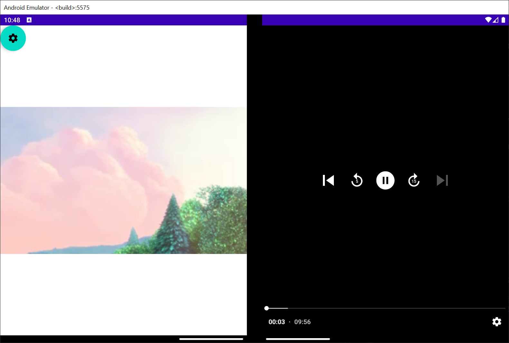
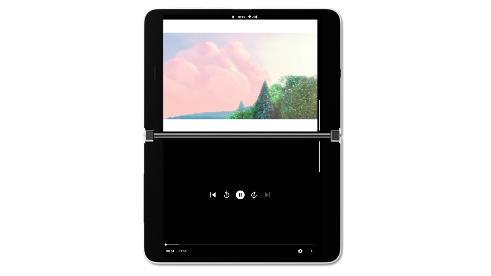

# FoldingVideo - Video with External Controls Sample

This sample app shows how video-playing apps can be adapted to dual-screen and foldable devices. When a video is cut off by a hinge or fold, you can separate the video and its controls onto separate halves of the device. By calculating the fold position with Jetpack Window Manager, we can use MotionLayout and ReactiveGuide to move the controls accordingly.

## Jetpack WM, MotionLayout, and ReactiveGuide

MotionLayout is used to animate the movement of the `PlayerView` and external `ControlView`. The `PlayerView` and the `ControlView` are constrained to a ReactiveGuide, which changes depending on the presence and location of a hinge/fold.

The app uses Jetpack Window Manager to detect the presence of a fold/hinge when the device’s layout configuration changes. When there is a hinge and the controls need to be separated from the video, the app calculates the position of the fold using the `FoldingFeature` provided by Jetpack WM’s `WindowLayoutInfo` and the `MotionLayout` view. The app pushes that fold position to the `ReactiveGuide`. The `PlayerView` and the `ControlView` are both constrained to the `ReactiveGuide` position, so they move accordingly to separate the video and the controls. The overlaid controls on the `PlayerView` are disabled, leaving only the video on one half, and the external controls on the other half. This is implemented twice, once for both orientations.

## Surface Duo Examples

In dual-portrait mode, we have the option to split the controls with the `FloatingActionButton` in the top left corner.

In dual-landscape mode, we always split the controls and leave the video on the top screen.

