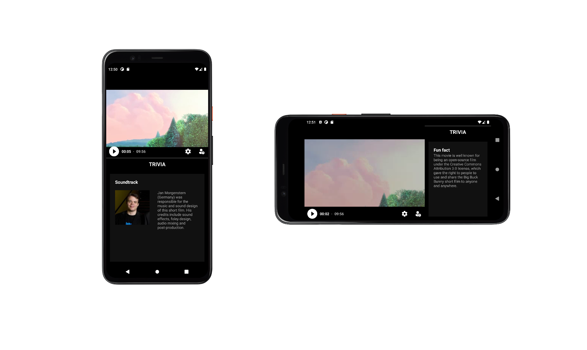
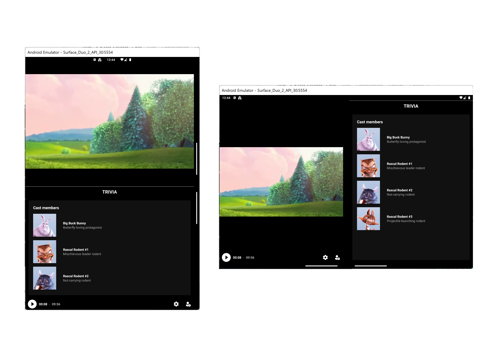
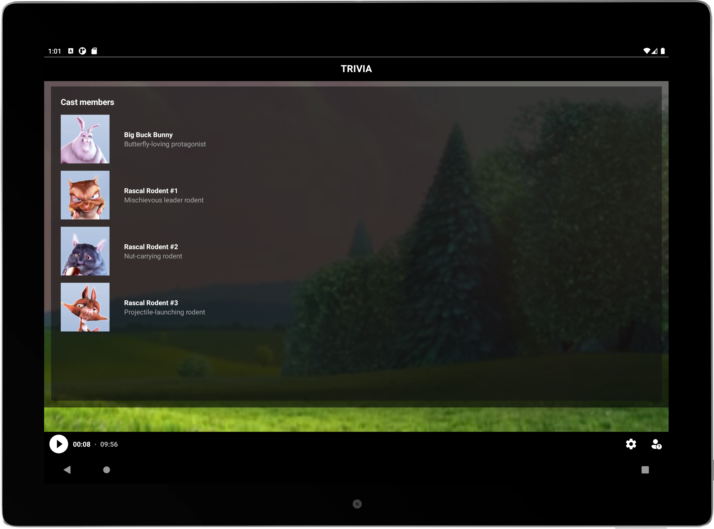

# Video + Trivia sample using Window Manager

This sample demonstrates how dual-screen/foldable devices can be well suited for streaming apps. Often streaming experiences will have both a video panel and a trivia panel. This app uses the information from Jetpack Window Manager to decide the best layout of these two panels. MotionLayout helps animate the transition between different layouts,  as the application is rotated around or spanned across a fold.  

## Screen Arrangement

On a single-screen device, this app divides the video and trivia panels at an arbitrary ratio. (70/30 in landscape orientations, 50/50 in portrait orientations). If the trivia panel is toggled off, the video panel expands to fullscreen.

When the app is spanned across a folding feature, like a hinge or a fold, the app arranges the panels on either side of the feature. The user can again toggle the trivia panel off, causing the video panel to expand across the feature.

> [!NOTE]
> The video panel should only move across the folding feature if the viewing experience is better!

On large screens, the trivia view is overlaid instead of split so users can enjoy the video at maximum size.

## MotionLayout and Guideline

The layout root, [activity_main.xml](app/src/main/res/layout/activity_main.xml) is a [MotionLayout](https://developer.android.com/training/constraint-layout/motionlayout). The video panel is constrained to the top of a vertically sliding [Guideline](https://developer.android.com/training/constraint-layout#constrain-to-a-guideline) and the start of a horizontally sliding Guideline. A trivia panel is constrained to the bottom of the vertical Guideline, and another is constrained to the end of the horizontal Guideline. In this layout, the Guidelines control whether the screen is divided vertically or horizontally.

The MotionLayout has multiple [ConstraintSets](https://developer.android.com/reference/androidx/constraintlayout/widget/ConstraintSet) defined in [activity_main_scene.xml](app/src/main/res/xml/activity_main_scene.xml). The "fullscreen" sets keeps the guidelines at the edges of the layout so the video takes up the whole screen - the large screen ConstraintSet also updates the trivia panel to overlay the video. The "shrunk" sets position the guidelines to show both a video and a trivia panel, and is modified by the program to fit the current device mode.

> [!TIP]
> MotionLayout can automatically apply animations to the transition between ConstraintSets

## Window Manager

In [MainActivity.kt](app/src/main/java/com/example/video_trivia_sample/MainActivity.kt) the `WindowManager` object registers a custom callback, to listen for when the device's layout mode changes. The `Consumer<WindowLayoutInfo>` checks for the presence of a hinge or fold in these cases. Layout changes, along with users pressing the trivia toggle button and opening the soft keyboard, trigger the `changeLayout()` function. `changeLayout()` decides the appropriate layout, and uses the `setGuidelines()` or `setFullscreen()` methods to manipulate the root MotionLayout.
