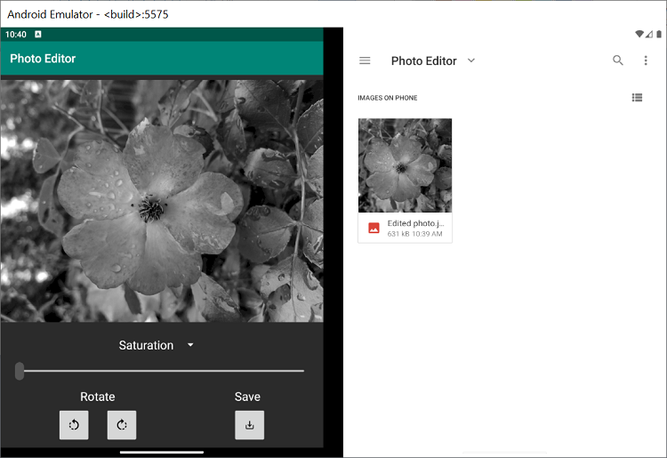
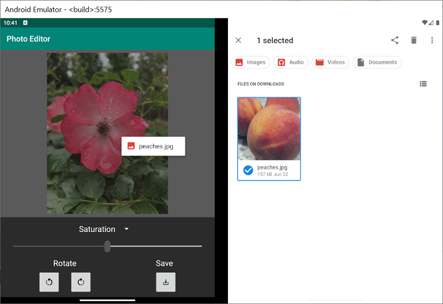
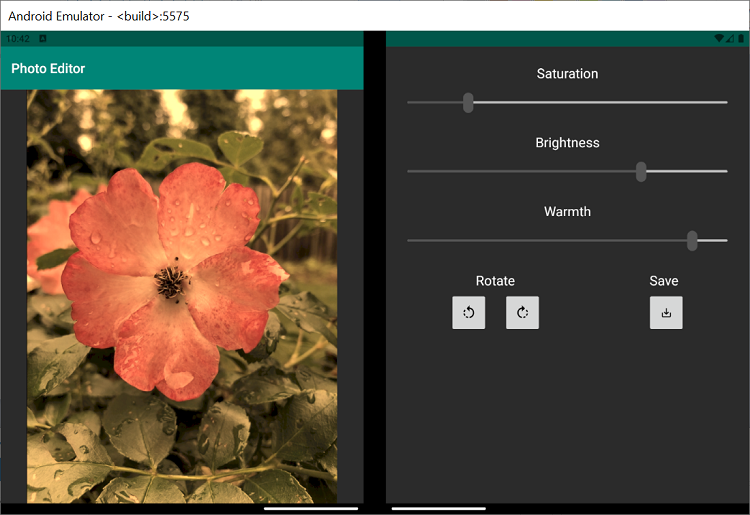

# PhotoEditor

This Kotlin application implements a simple photo editor that lets users select, edit, and save images. Screenshots of the application and its behavior are available [here](screenshots/).

## Getting Started

To learn how to load apps on the Surface Duo emulator, see the [documentation](https://docs.microsoft.com/dual-screen/android), and follow [the blog](https://devblogs.microsoft.com/surface-duo).

> [!NOTE]
> This application uses a beta release of the [Constraint Layout library](https://developer.android.com/jetpack/androidx/releases/constraintlayout) to facilitate image editing with the [ImageFilterView](https://developer.android.com/reference/androidx/constraintlayout/utils/widget/ImageFilterView) class.

## Features

This app supports three main actions: selection, editing, and saving. To select a photo, click on the current image to open the device's photo gallery. To modify image properties, use the buttons and sliders. Finally, to save the changes in a new photo, click the save button.

### Companion Pane

This sample shows how the [companion pane](https://docs.microsoft.com/dual-screen/introduction#companion-pane) dual-screen app pattern can be used to make more tools and controls available to users when the app is spanned. When in single-screen mode, the app only shows users three controls: the slider, the rotation buttons, and the save button. In order to modify all possible properties with the slider, the user must interact with the dropdown menu. This ensures that the chosen image is large enough on the screen to inspect any edits.

When switched to dual-screen mode, however, the entire left screen can be dedicated to image display. This frees up the right screen to display more editing controls. As a result, a dropdown menu is no longer needed and all three slider controls can be displayed.

### Drag and Drop

This sample also demonstrates how drag and drop features can simplify file transfer across screens and between applications. Instead of clicking to open the photo gallery and select a new photo, users can simply drag the desired image file into the app and drop it over the currently displayed image, as shown below. For more information, check out this [drag and drop sample](https://github.com/microsoft/surface-duo-sdk-samples-kotlin/tree/master/DragAndDrop).

### Dual-screen Layout

The SurfaceDuoLayout element of the [dual-screen layout](https://docs.microsoft.com/dual-screen/android/api-reference/dualscreen-library/) package is the key to developing applications on the Surface Duo. This layout provides different attributes for single-screen and dual-screen views, and example usage can be seen in [activity_main.xml](app/src/main/res/layout/activity_main.xml).

> [!NOTE]
> When defining landscape and portrait xml resources in Android Studio for the dual-screen view, the two screens are treated as one. That means the dual-screen landscape orientation is when the single-screen orientation would be considered portrait (shown below) and vice versa. For more tips, check out [this blog post](https://devblogs.microsoft.com/surface-duo/introducing-dual-screen-layouts-android/).

## Contributing

This project welcomes contributions and suggestions.  Most contributions require you to agree to a
Contributor License Agreement (CLA) declaring that you have the right to, and actually do, grant us
the rights to use your contribution. For details, visit https://cla.opensource.microsoft.com.

When you submit a pull request, a CLA bot will automatically determine whether you need to provide
a CLA and decorate the PR appropriately (e.g., status check, comment). Simply follow the instructions
provided by the bot. You will only need to do this once across all repos using our CLA.

This project has adopted the [Microsoft Open Source Code of Conduct](https://opensource.microsoft.com/codeofconduct/).
For more information see the [Code of Conduct FAQ](https://opensource.microsoft.com/codeofconduct/faq/) or
contact [opencode@microsoft.com](mailto:opencode@microsoft.com) with any additional questions or comments.

## License

Copyright (c) Microsoft Corporation.

MIT License

Permission is hereby granted, free of charge, to any person obtaining a copy of this software and associated documentation files (the "Software"), to deal in the Software without restriction, including without limitation the rights to use, copy, modify, merge, publish, distribute, sublicense, and/or sell copies of the Software, and to permit persons to whom the Software is furnished to do so, subject to the following conditions:

The above copyright notice and this permission notice shall be included in all copies or substantial portions of the Software.

THE SOFTWARE IS PROVIDED AS IS, WITHOUT WARRANTY OF ANY KIND, EXPRESS OR IMPLIED, INCLUDING BUT NOT LIMITED TO THE WARRANTIES OF MERCHANTABILITY, FITNESS FOR A PARTICULAR PURPOSE AND NONINFRINGEMENT. IN NO EVENT SHALL THE AUTHORS OR COPYRIGHT HOLDERS BE LIABLE FOR ANY CLAIM, DAMAGES OR OTHER LIABILITY, WHETHER IN AN ACTION OF CONTRACT, TORT OR OTHERWISE, ARISING FROM, OUT OF OR IN CONNECTION WITH THE SOFTWARE OR THE USE OR OTHER DEALINGS IN THE SOFTWARE.
