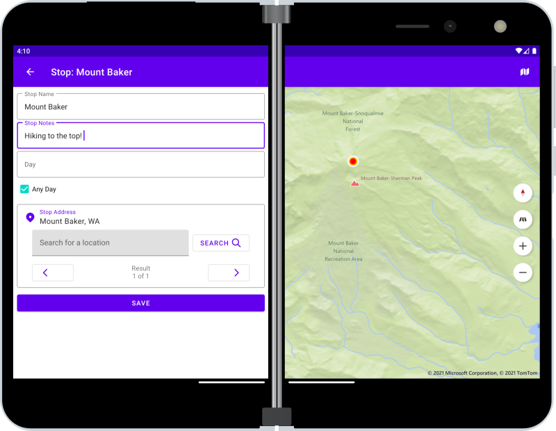

# Travel Planner - a dual-screen sample app

Sample app that uses SlidingPaneLayout to adapt to dual-screen and foldable devices, and Jetpack Room for data storage.

More information on the [Surface Duo developer blog](https://devblogs.microsoft.com/surface-duo/travel-planner-dual-screen-sample/)
