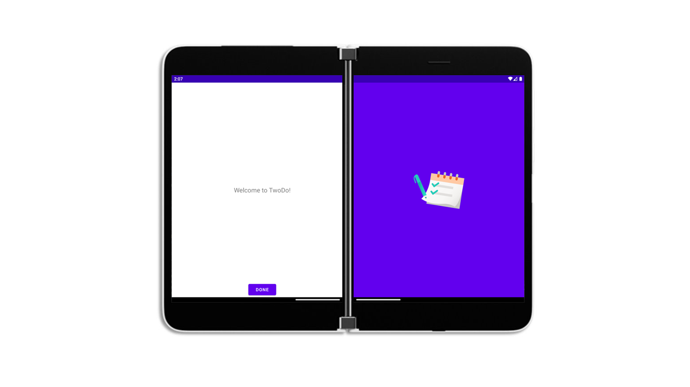
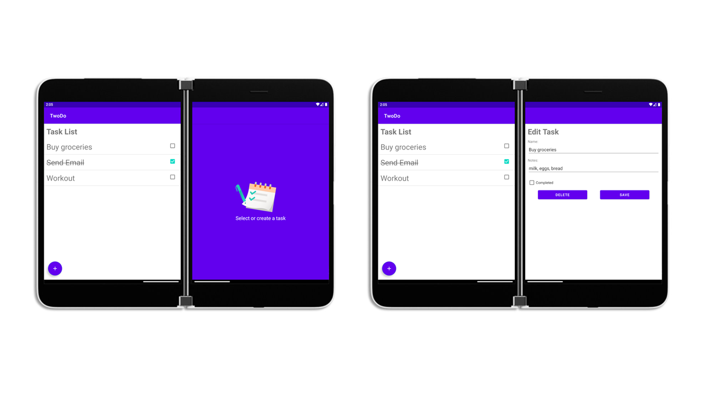
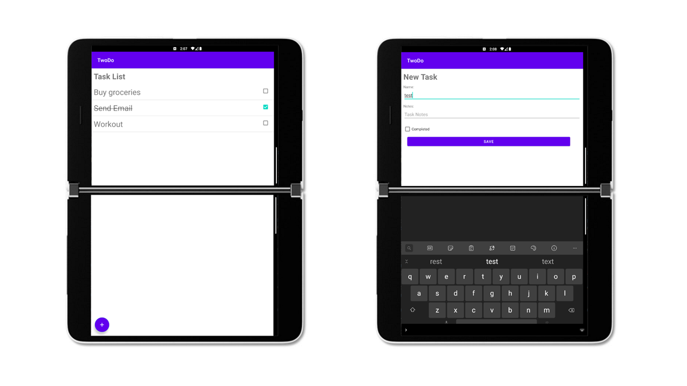

# TwoDo - A Dual-screen Todo list
This sample app is a todo list built for dual-screen devices like Surface Duo. It has the ability to view tasks on one screen, and create/edit tasks on the other screen.

## Technical Details
The app has two activities: a splash activity (`MainActivity.kt`), and the TwoDo activity (`TwoDoActivity.kt`). The splash activity serves as a "welcome" screen for TwoDo, while the TwoDo activity is the actual todo list.

### Splash Activity - Jetpack WM, MotionLayout, and ReactiveGuide
The splash activity shows how to create a dual-screen app in its simplest form. The welcome message appears normally, but when spanned, a logo screen appears on the other screen. This is done with Jetpack WM, `MotionLayout`, and `ReactiveGuide`. A relevant explanation of this technique can be found in another sample: [FoldingVideo](https://github.com/microsoft/surface-duo-window-manager-samples/tree/main/FoldingVideo).

### TwoDo Activity - SlidingPaneLayout and Room
The TwoDo activity leverages `SlidingPaneLayout` for is dual-screen capabilities, and Android Room for it's storage. 

The layout associated with this activity, `activity_two_do.xml`, has a `SlidingPaneLayout` root view. The root view has two children: a `Relativelayout` and a `FragmentContainerView`. The `RelativeLayout` contains the title text and button, as well as the `RecyclerView` that loads the tasks. The `FragmentContainerView` loads the new/edit task fragment or the logo fragment if we are not creating or editing a task.

Tasks are stored using Andorid Room. A task consists of four data fields: uid, name, notes, and complete (boolean). The uid is autogenerated as the primary key for the database table. Task table query, insert, update, and delete are ultimately available through a `TaskViewModel` instance that is shared between the activity and the fragments. A list of tasks are queried and provided to the `RecyclerView`'s `TaskAdapter` to render the list of tasks.

## Surface Duo Examples

Splash activity when the app is spanned:

TwoDo activity in dual-portrait mode:

TwoDo activity in dual-landscape mode:
