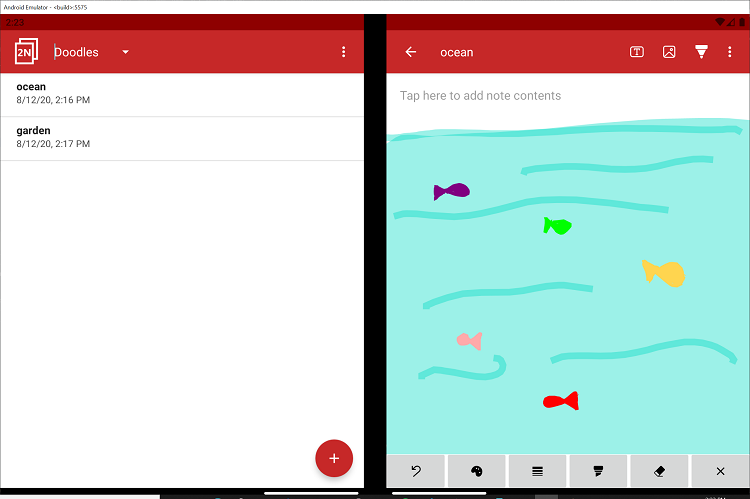

# TwoNote

This sample integrates various dual-screen app features into a note-taking app for the Surface Duo. Users can view and edit notes via the [list-detail](https://docs.microsoft.com/dual-screen/introduction#master-detail) or [extended canvas](https://docs.microsoft.com/dual-screen/introduction#extended-canvas) dual-screen app patterns. Each note may contain text and images, which can both be imported through drag/drop. In addition, users can add drawings and annotations to their notes with pen events.

## Getting Started

To learn how to load apps on the Surface Duo emulator, see the [documentation](https://docs.microsoft.com/dual-screen/android), and follow [the blog](https://devblogs.microsoft.com/surface-duo).

## Features

In addition to including various dual-screen enhancements, this app supports a range of operations related to notes, note categories, and note contents.

### Notes

Notes can be created by clicking the floating action button in the list view. To rename a note, click on its current title and make the desired changes. To delete a note, users can choose `Delete` from the overflow menu in the detail view of the note. To delete multiple notes at once, long-click on notes or choose `Select all` from the overflow menu in the list view. To share a screenshot of an individual note, choose the `Share` option in the note detail view.

### Categories

Notes can also be sorted into different categories, which are accessible via the dropdown in the list view. To add or delete a category, choose the appropriate option from the overflow menu. Like with notes, to rename a category, click on its current title and make the desired changes. To switch categories, open the dropdown and select a different category.

### Note Editing Modes

#### Text Mode - Drag and Drop

To add text to the note, click on the `Tap here to add note contents` hint and start typing. Users can also import existing text files to the note via drag/drop. For more information on creating drop targets for various drag events, reference this [drag and drop sample](https://github.com/microsoft/surface-duo-sdk-samples-kotlin/tree/master/DragAndDrop).

#### Image Mode - Drag and Drop

Images can be added to the note via drag and drop. Once imported, the images can be resized using zoom gestures on a particular image. Users can also move an image to a different position on the note by long clicking the image and dragging it. To delete an image, click the delete button and then click on any image that needs to be removed.

#### Ink Mode - Pen Events

This sample provides pen event support to allow for a smooth and pressure-sensitive inking experience. Users can use the buttons at the bottom of the screen to choose from a variety of colors and stroke thicknesses to write, draw, highlight, and erase within a note, as well as undo previous strokes and clear the entire canvas. To learn more about the capabilities of touch events and pens, visit this [pen event blog post](https://devblogs.microsoft.com/surface-duo/pen-events-on-the-surface-duo/).

### Extended Canvas

When spanned in dual-landscape mode, the app switches to the [extended canvas](https://docs.microsoft.com/dual-screen/introduction#extended-canvas) app pattern. This gives the user more screen real estate when editing note contents, which is especially useful for annotating pictures and creating drawings (see screenshot above).

### List-Detail

When spanned in dual-portrait mode, the app takes advantage of the [list-detail](https://docs.microsoft.com/dual-screen/introduction#master-detail) app pattern to simultaneously display a list of existing notes and a more detailed view of a selected note.

## Contributing

This project welcomes contributions and suggestions.  Most contributions require you to agree to a
Contributor License Agreement (CLA) declaring that you have the right to, and actually do, grant us
the rights to use your contribution. For details, visit https://cla.opensource.microsoft.com.

When you submit a pull request, a CLA bot will automatically determine whether you need to provide
a CLA and decorate the PR appropriately (e.g., status check, comment). Simply follow the instructions
provided by the bot. You will only need to do this once across all repos using our CLA.

This project has adopted the [Microsoft Open Source Code of Conduct](https://opensource.microsoft.com/codeofconduct/).
For more information see the [Code of Conduct FAQ](https://opensource.microsoft.com/codeofconduct/faq/) or
contact [opencode@microsoft.com](mailto:opencode@microsoft.com) with any additional questions or comments.

## License

Copyright (c) Microsoft Corporation.

MIT License

Permission is hereby granted, free of charge, to any person obtaining a copy of this software and associated documentation files (the "Software"), to deal in the Software without restriction, including without limitation the rights to use, copy, modify, merge, publish, distribute, sublicense, and/or sell copies of the Software, and to permit persons to whom the Software is furnished to do so, subject to the following conditions:

The above copyright notice and this permission notice shall be included in all copies or substantial portions of the Software.

THE SOFTWARE IS PROVIDED AS IS, WITHOUT WARRANTY OF ANY KIND, EXPRESS OR IMPLIED, INCLUDING BUT NOT LIMITED TO THE WARRANTIES OF MERCHANTABILITY, FITNESS FOR A PARTICULAR PURPOSE AND NONINFRINGEMENT. IN NO EVENT SHALL THE AUTHORS OR COPYRIGHT HOLDERS BE LIABLE FOR ANY CLAIM, DAMAGES OR OTHER LIABILITY, WHETHER IN AN ACTION OF CONTRACT, TORT OR OTHERWISE, ARISING FROM, OUT OF OR IN CONNECTION WITH THE SOFTWARE OR THE USE OR OTHER DEALINGS IN THE SOFTWARE.
