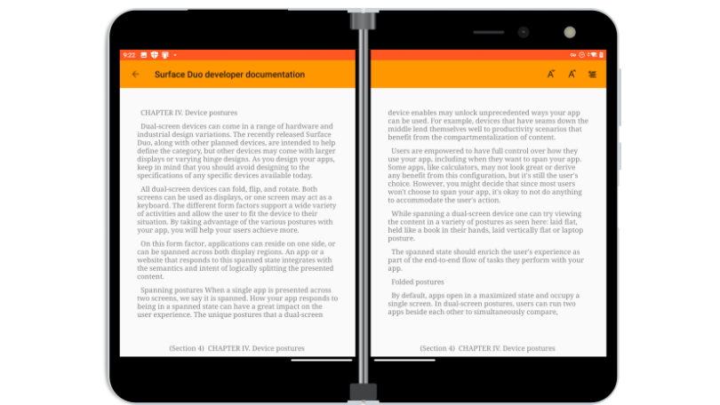
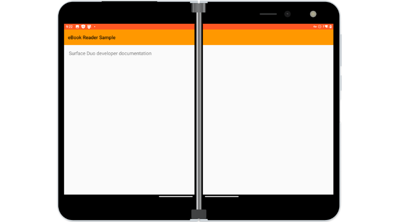

# eBook Reader sample using Window Manager

This sample demonstrates the Two Page design pattern for foldable devices. In this pattern, apps can take advantage of a foldable device's natural boundary to show multiple items from a collection. EBooks are a perfect application of this pattern, as their physical predecessors could be called "dual-leaf hinged devices". See other design patterns in [Microsoft's UX Design documentation](https://docs.microsoft.com/en-us/dual-screen/introduction).

## Base functionality

Public works from [Project Gutenberg](https://www.gutenberg.org/) were downloaded into the [assets](app/src/main/assets/books) folder of this app. All plaintext versions of Project Gutenberg books should be processable, so feel free to add other books in this folder. [Book.kt](app/src/main/java/com/example/ebook_reader_sample/Book.kt) parses the selected book, separating the file into chapters by line number. Selecting a chapter prompts the book to cache that chapter's paragraphs as strings. The `buildPages()` function uses saved layout information and cached chapter paragraphs to further organize the strings into pages.

`ViewPager2` is an upgraded `RecyclerView` developed by Android to slide between `Views`. This sample displays book pages in a [ViewPager2](https://developer.android.com/training/animation/screen-slide-2) with single-page or two-page `ViewHolders`. While [BookActivity.kt](app/src/main/java/com/example/ebook_reader_sample/BookActivity.kt) manages the app's layout and user interaction, the custom `Adapter` in [BookPager.kt](app/src/main/java/com/example/ebook_reader_sample/BookPager.kt) handles populating the `ViewPager2` with custom `ViewHolders`.

> [!NOTE]
> This sample finds the `Rect` of the pager view through an initial, "empty" render. This Rect is later compared to the `Rects` of Window Manager `FoldingFeatures` to properly divide the screen space into pages.

## Dual-screen enhancements

Very little extra code in `BookActivity` was necessary to enable two-page layout for the eBook reader. This code is marked by `TODO` comments. `BookActivity` uses [Jetpack Window Manager](https://developer.android.com/jetpack/androidx/releases/window) alphas to collect display feature information. If folding features are detected, the `ViewPager2` `ViewHolders` inflate "split" page layouts instead of "normal" page layouts. [(Find these layouts in the layout folder)](app/src/main/res/layout). Additonally, the position and width of the fold are used to calculate new `Rects` for the Book to adhere to.

In `StartActivity`, where users choose a book to read, Android Jetpack's [SlidingPaneLayout](https://developer.android.com/reference/androidx/slidingpanelayout/widget/SlidingPaneLayout) can keep the book chooser on one side of a fold. There are definitely better, more in-depth samples demonstrating `SlidingPaneLayout` in public Microsoft repositories. However, the solution for this application was simple: include a [SlidingPaneLayout](app/src/main/res/layout/activity_start.xml) with functional elements on the left and an empty, 0-width `View` on the right. *This trick required only a few lines of XML, and zero code.*

