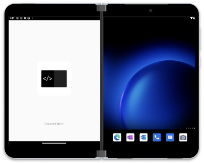
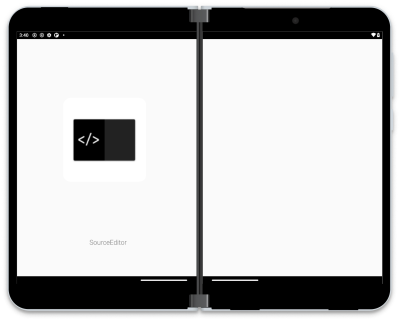
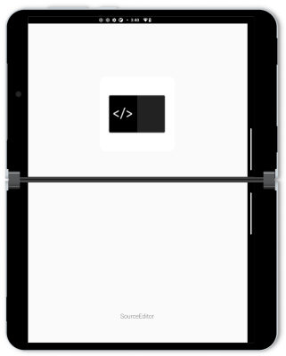

# Auto-span splash screen

Most of these samples implement a simple splash screen in a way that can adapt for Surface Duo auto-spanning.



  

Complete these steps to create a dual-screen friendly splash-screen that uses resource qualifiers to show on Surface Duo devices when the app is started in spanned mode:

- Create a `splash.xml` drawable that contains a `layer-list` root element:
  - The default file (in `/drawable/` directory) is built for single screens and is usually centered:

    ```xml
    <?xml version="1.0" encoding="utf-8"?>
    <layer-list
        xmlns:android="http://schemas.android.com/apk/res/android"
        android:opacity="opaque">
        <item android:drawable="?android:colorBackground" />
        <item
            android:width="200dp"
            android:height="200dp"
            android:gravity="center"
            android:drawable="@mipmap/ic_launcher"
            />
        <item android:bottom="84.0dip"
            android:gravity="bottom|center"
            android:drawable="@drawable/splash_logo" />
        />
    </layer-list>
    ```

  - Dual-screen versions using resource qualifiers that match the Surface Duo and Surface Duo 2:
    - `drawable-sw720dp-2754x1800` - dual-landscape mode, align the elements above & below the hinge
    - `drawable-sw720dp-land-2754x1800` - dual-portrait mode, align the elements onto a single (left?) screen, or position them either side of the hinge

  - These examples also use a `splash_logo.xml` drawable.

- Create an `activity_splash.xml` layout - use `android:windowBackground` on the root element to reference the splash screen drawable (eg. `@drawable/splash_background`)

    ```xml
    <?xml version="1.0" encoding="utf-8"?>
    <androidx.constraintlayout.widget.ConstraintLayout
        xmlns:android="http://schemas.android.com/apk/res/android"
        xmlns:app="http://schemas.android.com/apk/res-auto"
        android:layout_width="match_parent"
        android:layout_height="match_parent"
        android:windowBackground="@drawable/splash">
    </androidx.constraintlayout.widget.ConstraintLayout>
    ```

- Add `SplashActivity.kt` to the project, which will show the splash screen and kick off the main activity:

    ```kotlin
    class SplashActivity : AppCompatActivity() {
        override fun onCreate(savedInstanceState: Bundle?) {
            super.onCreate(savedInstanceState)
            setContentView(R.layout.activity_splash)
            startActivity(Intent(this, MainActivity::class.java))
        }
    }
    ```

- Update `styles.xml` values file to define a splash theme that references the background drawable as well:

    ```xml
    <style name="Theme.Splash" parent="Theme.AppCompat.Light.DarkActionBar">
        <item name="android:windowBackground">@drawable/splash_background</item>
        <item name="android:windowDrawsSystemBarBackgrounds">false</item>
    </style>
    ```

    If you have multiple styles files under different resource qualifiers, make sure all cases include the splash theme.

- Update `AndroidManifest.xml`:
  - Make the `SplashActivity` the main/launcher activity
  - Add the splash theme to the splash activity element

    ```xml
    <activity
        android:name=".SplashActivity"
        android:theme="@style/Theme.Splash"
    ```

  - Don't forget your `MainActivity` element:

    ```xml
    <activity
        android:name=".MainActivity"
    ```

When the app is configured to auto-span (in **Settings > Surface Duo features > Span apps automatically**) then the correct splash screen layout will be used while the app loads.
