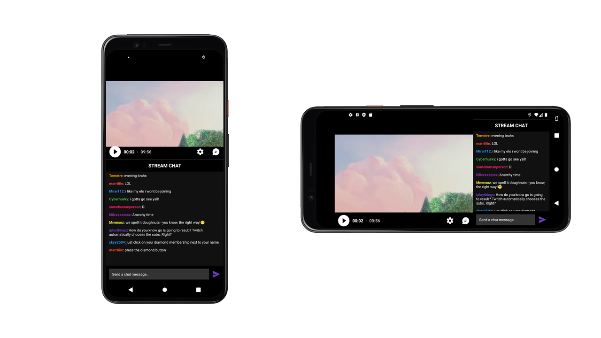
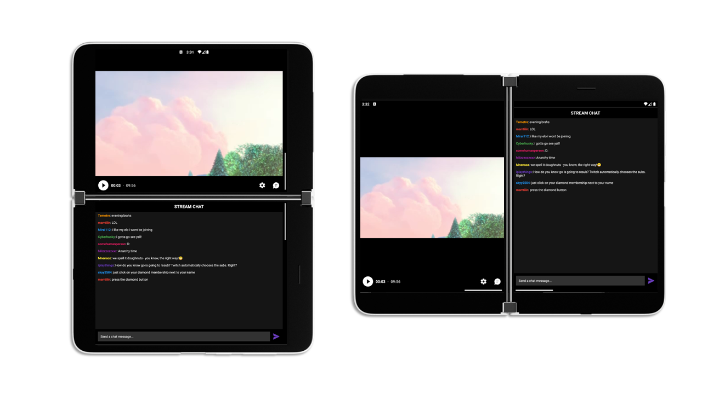

# Video + Chat sample using Window Manager

This sample demonstrates how dual-screen/foldable devices can be well suited for streaming apps. Often streaming experiences will have both a video panel and a live discussion panel. This app uses the information from Jetpack Window Manager to decide the best layout of these two panels. MotionLayout helps animate the transition between different layouts,  as the application is rotated around, typed in, or spanned across a fold.  

## Screen Arrangement

On a single-screen device, this app divides the video and chat panels at an arbitrary ratio. (70/30 in landscape orientations, 50/50 in portrait orientations). If the chat panel is toggled off, the video panel expands to fullscreen.

When the app is spanned across a folding feature, like a hinge or a fold, the app arranges the panels on either side of the feature. The user can again toggle the chat panel off, causing the video panel to expand across the feature.

> [!NOTE]
> If the video experience would not improve, the video will not move across the folding feature!

## MotionLayout and Guideline

The layout root, [activity_main.xml](app\src\main\res\layout\activity_main.xml) is a [MotionLayout](https://developer.android.com/training/constraint-layout/motionlayout). The video panel is constrained to the top of a vertically sliding [Guideline](https://developer.android.com/training/constraint-layout#constrain-to-a-guideline) and the start of a horizontally sliding Guideline. A chat panel is constrained to the bottom of the vertical Guideline, and another is constrained to the end of the horizontal Guideline. In this layout, the Guidelines control whether the screen is divided vertically or horizontally.

The MotionLayout has two [ConstraintSets](https://developer.android.com/reference/androidx/constraintlayout/widget/ConstraintSet) defined in [activity_main_scene.xml](app\src\main\res\xml\activity_main_scene.xml). The "fullscreen" ConstraintSet keeps the guidelines at the edges of the layout, hiding both chat panels. The "shrunk" ConstraintSet positions the guidelines to show both a video and a chat panel, and is modified by the program to fit the current device mode.

> [!TIP]
> MotionLayout can automatically apply animations to the transition between ConstraintSets

## Window Manager

In [MainActivity.kt](app\src\main\java\com\example\video_chat_sample\MainActivity.kt) the `WindowManager` object registers a custom callback, to listen for when the device's layout mode changes. The `Consumer<WindowLayoutInfo>` checks for the presence of a hinge or fold in these cases. Layout changes, along with users pressing the chat toggle button and opening the soft keyboard, trigger the `changeLayout()` function. `changeLayout()` decides the appropriate layout, and uses the `setGuidelines()` or `setFullscreen()` methods to manipulate the root MotionLayout.
